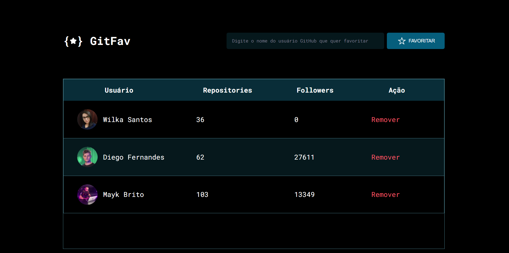

<h1 align="center">GitFav</h1>

 O Explorer é um programa completo que reúne tudo o que você precisa para iniciar no mundo da programação Web, te auxiliando a desenvolver suas habilidades técnicas e comportamentais, para que você alcance sua primeira vaga no mercado de programação. 

  <a href="#-tecnologias">Tecnologias</a>&nbsp;&nbsp;&nbsp;|&nbsp;&nbsp;&nbsp;
  <a href="#-projeto">Projeto</a>&nbsp;&nbsp;&nbsp;|&nbsp;&nbsp;&nbsp;
  <a href="#-layout">Layout</a>&nbsp;&nbsp;&nbsp;|&nbsp;&nbsp;&nbsp;
  <a href="#memo-licença">Licença</a>

  

 

  

 

## 🚀 Tecnologias

Esse projeto foi desenvolvido com as seguintes tecnologias:

- HTML e CSS
- Javascript
- Figma

 
## 💻 Projeto

Desenvolver uma aplicação chamada "GitFav", para guardar os usuários favoritos do GitHub e essa aplicação através da api do Git retorna alguns dados dos usuários favoritos como: Nome, Quantidades de Repositórios e Followers.

- [Visite o projeto]()

 
## 🔖 Layout

O layout do projeto encontra-se no Figma e você pode ter acesso através [DESSE LINK](https://www.figma.com/file/EwQfYyoCx21Vl8CwzQeCZN/%5BDesafios-Explorer%5D-GitFav-(Copy)-(Copy)?node-id=104-48&t=AF1CJkSDviQhD3u3-0).

 
## 🔒 Layout

Esse projeto está sob a licença MIT.
